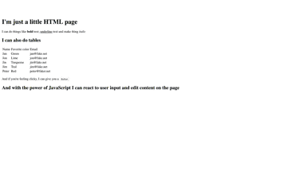

# Helsinki Events App
In this Mimmit Koodaa -workshop we'll be creating an web app that allows us to search for events in Helsinki using a search term.

Before we go creating that app, lets briefly discuss the role of HTML, CSS and JavaScript by creating a simple search page.

## So, which language should we choose?
The list of languages keeps growing and the existing languages are constantly being developed and updated. Everyone has their own opinion on what's the best language for what purpose but in this excersise we'll focus on HTML and JavaScript.

> :bulb: According to [StackOverflow Developer Study 2018](https://insights.stackoverflow.com/survey/2018/#most-popular-technologies), JavaScript is still the most popular technology amongst their survey respondands.

### In this workshop we will use

* **HTML** to build the base for our website. The text, buttons, inputs and other elements.
  * The outcome will be a working website but it won't have functionality and it won't have any styling.
* **CSS** will allow us to define the look and styling of our page by defining rules based on element types, names and classes.
  * For example all the buttons should be extra wide. The table should have different colored odd rows. Or maybe everything that is a "quote" should have italic text and in gray color.
* **JavaScript** will allow us to add more functionality to the page, update content and react to the users actions.
  * Use this for example to update the news on the site every 15 seconds or to change the background image when the user clicks at button.
  * Or to change the background to be animated in the colors of the rainbow on a click of a buttom.



As you learn more about web development you'll notice that there are different languages: programming, scripting and markup languages. In addition, there are frameworks, engines and so much more.

When you start off, don't spend too much time worrying about what language to choose. JavaScript is a great way to get started, and to build a career with. It's powerful, runs in many different environments and it's very popular (=has a great community).

## Creating the Search-page
So let's get working on creating our page. First, we will create a new HTML page with a search field and a button.

1. Create a new folder on your desktop called Mimmitkoodaa
1. Open up your editor (VS Code) and click to Open Folder. Find the empty Mimmitkoodaa folder on your desktop and open it.
1. Create a new index.html file in VS Code (File -> New File)
1. Write the base for your html page (sample below)
1. Save the page as index.html on your computer in a new folder on your desktop called "Mimmitkoodaa"
1. Open the file with your browser

```html
<!doctype html>

<html>
  <head>
    <title>Search for Helsinki Events</title>
  </head>

  <body>
    Hello world!
  </body>
</html>
```

Now there's not much there, so lets create a search box and a button on the page. We'll add a heading, define the html elements (input), give each element a type (text/button). We'll also give both inputs an unique ID, so we can easily find them from our JavaScript code.

Replace the contents of the body with the markup below:
```html
<h1>Search for events in Helsinki</h1>

<label for="searchText">Event name</label>
<input type="text" id="searchText" name="searchText" />
<button>Search</button>
```

Now if you open the page again in the browser, you should see the updated UI.

Right now our button doesn't really do anything. It doesn't search for events and doesn't really react to our click. So lets see how we can use JavaScript to react to an `onclick` event on the button.

### Using JavaScript to react to the button click
Before we start searching for events, we need to get the value that the user wrote into the search box. So in the next step we will do the following:
1. Add some JavaScript to our page
1. Create a function
    * **Woah woah, hold up there. What's a function?** Well essentially a function encapsulates a task, like "show an a alert", in a single line of code. So instead of writing the same lines of code over and over again, every time you want to alert what the user wrote in their search box, you place this into a function and you can then call that function by it's name from different parts of your program (=reuse the same code).
1. Inside our newly created function we tell JavaScript to show an alert with the value the user wrote in the search box on the page.
    * JavaScript can access the HTML document and find elements by their name, ID, class and tag.
1. Tell our button to call our new function when it's clicked

*We don't necessarily need JavaScript to have the button submit a form for example, but we'll use this as an opportunity to introduce JavaScript. You'll see an example of a form later in this workshop*

Add this JavaScript code to your HTML-page after the button and before you close the body tag.
```javascript
<script>
  function sayHello() {
    alert(document.getElementById('searchText').value);
  }
</script>
```
And then update your button to call for that function when it's clicked
```html
 <button onclick="sayHello()">Search</button>
```

Now go to your browser and refresh the page. Write something into the search field and click the button.. and BOOM! You have alert popping up with the text! :boom:

### :mag: 'View source' to see what the browser reads
If you right-click on the page in our browser and select "View Source" you'll see the all the code you wrote.

This is because both HTML and JS are running on the client-side and the client (=browser, in this case) interprets the code and renders it to elements and actions.

Each browser has it's own way of interepting these but thanks to [web standards](https://www.w3.org/standards/), we have a common set of rules that all major browser follow.

### :bulb: Validate the input with simple if/else statements

What if we want to check what the search query is, before we show the alert? Maybe we want to tell the user that they shouldn't submit an empty query, as that will return all the events?

Lets explore vaiable 

* We will create a variable where we store the value of our `searchQuery` input field. We store it in a variable, so we don't have to search for it every time from the document and can have a "copy" of the value in the variable `text`
* Check if the user's query has no value and if so, advise them to search for something instead of nothing.
* If the search query isn't empty, we will show them what they searched for.

```javascript
<script>
  function sayHello() {
    var text = document.getElementById('searchText').value;

    if(text == "") {
      alert("Hmm.. maybe you want to try entering something for better results?");
    }
    else {
      alert("You searched for " + text);
    }
  }
</script>
```

Save your changes and head to the browser, refresh your page and test that the validation works properly.

**:mag: Got some extra time?** Almost any search will do what we did above: limit submiting an empty query. But most will also check for the minimal length of input before sending, for example: you must enter at least 3 characters to search. Try looking up how would you implement that!

At this point, take a breather and congratulate yourself.. and if you're the expressive type whaile your hands in the air :tada::tada::tada:

**Next :arrow_right: [Running JavaScript on a server with Node.js](https://github.com/MSFTGarageFi/mimmitkoodaa/blob/master/web-dev-intro/part3_helloNodeJS.md)**
