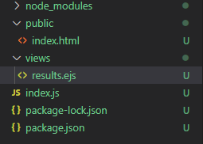
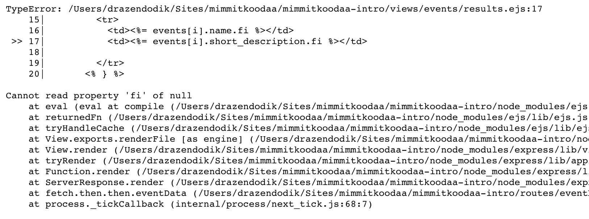

# It's all about APIs :metal:
You might have heard about APIs before, as it seems that they're popping up in all kinds of conversations.

>In computer programming, an application programming interface (API) is a set of subroutine definitions, communication protocols, and tools for building software. - Wikipedia

Essentially, an API is something that you expose either internally between your apps(s) or expose to external apps allow them to access certain functionality or data that you have

The APIs we'll be using come from the city of Helsinki (https://api.hel.fi/). They have different types of data available about the city, transportation, where the snowplows are and also, what events are happening in Helsinki through the [Linked Events API](https://api.hel.fi/linkedevents/v1/).

> APIs can be completely open and free, like the ones from the city of Helsinki but they can also be behind authentication (like Yle Areena) and of course some APIs having pricing.
>
> Sometimes we'll use APIs to access data, like information about the upcoming events in Helsinki. And sometimes we use APIs like Computer Vision service on Microsoft Azure to send a photo to the machine learning algorithm and ask it to analyze it.

## In what format do APIs provide data?
There are several different formants in which APIs can provide you with data, but one of the most common ones is **JSON** (JavaScript Object Notation). It's basically a commonly agreed format to share data, that's easy for both humans and machines to read and process.

JSON Object example from [W3C](https://www.w3schools.com/js/js_json_objects.asp), where we have an object called "myObj" that has a three properties: name (text), age (number) and cars (array). In addition each car has just one property (the name).
```json
myObj = {
    "name":"John",
    "age":30,
    "cars": {
        "car1":"Ford",
        "car2":"BMW",
        "car3":"Fiat"
    }
 }
 ```

When you navigate to the Linked Events API you'll be able to request JSON as the format, so we can use the data in our application.

JSON Response sample for [search query "malmi" from Linked Events API](https://api.hel.fi/linkedevents/v1/event/?format=json&text=malmi).

* There are two arrays at the first level: meta and data
* Under data we can find an array that contains events
* Each event contains properties like event_status and start_time. Events also have arrays like description, which contains fi, sv and en version.
```json
{
  "meta": {
    "count": 4384,
    "next": "https://api.hel.fi/linkedevents/v1/event/?format=json&page=2&text=malmi",
    "previous": null
  },
  "data": [
    {
      "id": "kulke:46574",
      "location": {
        "@id": "https://api.hel.fi/linkedevents/v1/place/tprek:8740/?format=json"
      },
      "keywords": [...],
      "super_event": null,
      "event_status": "EventScheduled",
      "external_links": [],
      "offers": [],
      "data_source": "kulke",
      "publisher": "ahjo:u4804001050",
      "sub_events": [],
      "in_language": [],
      "audience": [],
      "created_time": "2018-11-07T13:18:18.806625Z",
      "last_modified_time": "2018-11-08T14:14:28.766834Z",
      "date_published": null,
      "start_time": "2018-12-14T15:00:00Z",
      "end_time": null,
      "custom_data": null,
      "super_event_type": null,
      "description": {
        "fi": "<p>Pukinmäen taidekoulujen eri taiteenalojen (teatteri, tanssi, sirkus) yhteistyöprojekti, jossa Lumikki, Tähkäpää ja Tuhkimo ovat paenneet satumaailmasta ja nyt satuihin pitäisi löytää äkkiä uudet prinsessat!</p><p>Niinpä kaksi näppärää elämäntapavalmentajaa ryhtyvät pelastamaan satumaailmaa.</p><p>He onnistuvat houkuttelemaan iloisesta hirviöjoukosta prinsessoille sijaiset ja loihtivat heidät satujen kaunottariksi. Mutta onko satumaailma ja kaunottarena olo niin ihanaa kuin ajatellaan? Ja onko ulkoinen kauneus avain onneen?</p><p>Esitys koskettaa, naurattaa ja kertoo tuttujen satujen hahmoista sekä satumaailmasta sinulle ehkä jotain uutta.</p><p>Esitys sopii koko perheelle. Esityksen kesto noin 40 min. Tervetuloa!</p><p>Ohjaus: Vilma Salmi<br>Sirkusohjaus ja koreografiat: Sanni Sarlin<br>Käsikirjoitus: Vilma Salmi, Sanni Sarlin ja työryhmä<br>Hirviötanssin koreografia: Salli Tommola<br>Puvustus: Elisa Auvinen</p><p>Kesto noin 40 min</p><p>Ryhmälippu 7,5 €/hlö</p>",
        "sv": "<p>På scenen glänser Pukinmäki taidekoulus karismatiska unga uppträdare i olika åldrar.</p><p>Cirkusgrenar vi får se är akrobati, luftakrobati, balansgång, jonglering och clowneri. Uppträdandet är för hela familjen.</p>",
        "en": "<p>The charismatic young performers from Pukinmäki art schools are set to take the stage.</p><p>The circus acts include acrobatics, aerial acrobatics, balancing, juggling, and clownery. The shows are fun for the entire family.</p>"
      },
      "info_url": {
        "fi": "http://www.malmitalo.fi/fi/tapahtumat/event/8500AA4962C0A08E2B8249131AC733B8/Kaunotar_vai_Hirvio",
        "sv": "http://www.malmitalo.fi/sv/evenemangen/event/8500AA4962C0A08E2B8249131AC733B8/Kaunotar_vai_Hirvio",
        "en": "http://www.malmitalo.fi/en/events/event/8500AA4962C0A08E2B8249131AC733B8/Kaunotar_vai_Hirvio"
      },
      "short_description": {
        "fi": "Pukinmäen taidekoulujen eri taiteenalojen (teatteri, tanssi, sirkus) yhteistyöprojekti, jossa Lumikki, Tähkäpää ja Tuhkimo ovat paenneet satumaailmasta ja nyt satuihin pitäisi löytää äkkiä uudet prinsessat!",
        "sv": "På scenen glänser Pukinmäki taidekoulus karismatiska unga uppträdare i olika åldrar.",
        "en": "The charismatic young performers from Pukinmäki art schools are set to take the stage."
      },
      "provider": null,
      "name": {
        "fi": "Kaunotar vai Hirviö – Pukinmäen taidekoulut",
        "sv": "Kaunotar vai Hirviö – Pukinmäen taidekoulut",
        "en": "Kaunotar vai Hirviö – Pukinmäen taidekoulut"
      },
      "location_extra_info": null,
      "@id": "https://api.hel.fi/linkedevents/v1/event/kulke:46574/?format=json",
      "@context": "http://schema.org",
      "@type": "Event/LinkedEvent",
      "images": [
        {
          "id": 48328,
          "license": "event_only",
          "created_time": "2018-11-07T13:18:18.794727Z",
          "last_modified_time": "2018-11-07T13:18:18.794747Z",
          "name": "",
          "url": "http://www.malmitalo.fi/instancedata/prime_product_resurssivaraus/kulke/embeds/EventPic_634760.jpg",
          "cropping": "",
          "photographer_name": null,
          "data_source": "kulke",
          "publisher": "ahjo:u4804001050",
          "@id": "https://api.hel.fi/linkedevents/v1/image/48328/?format=json",
          "@context": "http://schema.org",
          "@type": "ImageObject"
        }
      ]
    }
```

## Getting the data from front to back
To make our backend application truly interactive, let’s get the data from the front back to the backend!

For this, we are going to change our index.html, so that the search field can be submitted as a part of the form. This form will POST the submission to /post, which we will need to listen for in our Node.js backend.

Add the form tag to your HTML file.

```html
    <form method="post" action="/post">
      <label for="searchText">Event name</label>
      <input type="text" id="searchText" name="searchText" />
      <button type="submit" onclick="sayHello()">Search</button>
    </form>
```

For Node to be able to interpret the data being sent it's going to need something called a body-parser. This, you guessed it, npm package let's node parse the incoming data, like the form submission.

From the terminal run `npm install body-parser`

Then update your index.js to use body-parser when passing pages and data around. Add the following lines to your index.js

**Place all required commands at the top of your page and the app.use and app.set commands after them, before your app.get routing**

```javascript
// require the body-parser so we can easily read data that is passed from our form
var bodyParser = require('body-parser');

// tell express to use bodyparser and JSON
app.use(bodyParser.urlencoded({extended: true}));
app.use(bodyParser.json());
```

Now let's let Node know that we'll be posting someting to /post and get the value of our search term.
```javascript
app.route('/post').post(function (req, res) {
  var searchTerm = request.body.searchText;
};
```

:bulb: Did you know that you can run your project in debug mode by pressing F5 and if you click on the empty space left of the row number you can place a break point which will allow you to inspect the incoming values by hovering over variables?


Next we'll be fetching matching events on server-side so for that we'll need another package: node-fetch.
From terminal install with `npm install node-fetch`
And then again add to index.js that we can use it inside of our app:
```javascript
// require node-fetch so we can easily get the JSON from the Helsinki city APIs
var fetch = require('node-fetch');
```
Now lets fetch data from the Linked Events API by passing it our search parameter

```javascript
EventRouter.route('/post').post(function (request, response) {
  // get the text that was submitted to the form from the request body.
  // the name of the text-field on our form is searchText
  var searchTerm = request.body.searchText;

  // fetch the JSON from Linked Events API in JSON and use our search term for the text parameter
  fetch('https://api.hel.fi/linkedevents/v1/event/?format=json&text='+searchTerm)
    .then(helResponse => helResponse.json()) // parse the response as JSON
    .then(eventData => { // take the parsed JSON as eventData and
      console.log(eventData.data) // Print all the JSON to our console for debugging

      response.send(eventData.data)
    })
    .catch(error => console.error(error)); // in case of error print it to our commandline
});
```
Wau, doesn't that look beautiful ;)

Can you guess what's the next step? Yep. We need to create the results page to show our results. To make it easier for us to generate the HTML-markup across the pages, we'll use a JavaScript templating language called EJS.

Example of using EJS inside of HTML (this would show the value of the JavaScript variable searchQuery)
```html
You searched for <%=searchQuery%>
```

Install ejs from the terminal: `npm install ejs`

And let's tell our app that ejs is our view engine. Add the following line into your index.js file:
```javascript
// tell express that we'll use ejs as our view engine
app.set('view engine', 'ejs');
```

Now let's create a folder to store our result views. Let's call it `views`.

Create a new folder called `views` and add a file named `results.ejs`. Inside it create a title and a table in which we'll show the event results.

```html
<!DOCTYPE html>
<html>
  <head>
    <title>#HEL Event results</title>
  </head>
  <body>

    <h1>Results for </h1>
    <table id="resultsTable">
      <thead>
        <td>Name</td>
        <td>Description</td>
        <td>Image</td>
      </thead>

    </table>

  </body>
</html>
```
Now that we have added all the files, our folder structure should look like this:



Let's push our fetch results to the newly created results.ejs page.
Update the response.send(eventData.data) to:
 ```javascript
 response.render('results', {searchTerm: searchTerm, events: eventData.data});
```
This will send two parameters to the results page: searchTerm object, containing the search term and the events object, containing eventData.data.

Run your app again, navigate to the search form and submit a query to ensure the page is rendering correctly. You should see an empty table with Name, Description and Image.

Of course this is just the skeleton for our page and doesn't contain any actual data. Now we'll get to add some EJS magic :sparkles:

:exclamation: Remember in our index.js we said we want to pass the **searchTerm** and **events** objects to the results page :exclamation:

First lets update the title of the page to show the searchTerm. We use a special ejs syntax for this:

`<h1>Results for <%=searchTerm%></h1>`

Using <%= and %> we tell ejs to render the value of a JavaScript variable.

Next we need to go through the events object that contains all the JSON events we've gotten from the Linked Events API and render them on our table. In this case we'll render the name of the event and its short description.

Please the following code in `results.ejs` after `</thead>`

```javascript
/*For as long as i is smaller than the number of items in the events collection loop through this. For each item then show name and short_description*/
<%
for(var i=0; i < events.length; i++) { 
%>
  <tr>
    <td><%= events[i].name.fi %></td>
    <td><%= events[i].short_description.fi %></td>
  </tr>
<%
}
%>
```

The `name` and `short_description` properties are defined by the API. Go back and have a look at the JSON you received from Linked Events to understand the structure of the JSON they provide.

The JSON data contains properties like description_short that are not mandatory fields, which means that sometimes there isn't a short_description available. So if you try to search for some terms (like currently 'punavuori') that contains events without a short_description, you will see a JavaScript error like the one below:



Lets fix this with a simple if-statement
```javascript
<% 
if(events[i].short_description != null) { 
%>
  <td><%= events[i].short_description.fi %></td>
<%
} 
else { 
%>
  <td>No description available</td> 
<%
}
%>
```

:mag: Some of the events have an image attached to them. Try to add an image to the table.

*:tada::tada: You have now completed the workshop! :tada::tada::tada:* Pat yourself on the back, ask a friend to pat you on the back, celebrate and look at the glory that is your Helsinki Events app.
